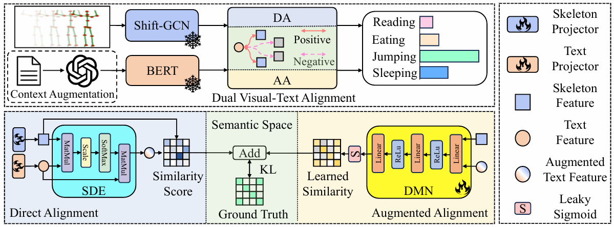

# [DVTA: Zero-Shot Skeleton-based Action Recognition with Dual Visual-Text Alignment](https://www.sciencedirect.com/science/article/abs/pii/S0031320325010039), [arXiv](https://arxiv.org/abs/2409.14336)

This repository contains the official PyTorch implementation for the paper **"Zero-Shot Skeleton-based Action Recognition with Dual Visual-Text Alignment" (DVTA)**, Pattern Recognition, 2026.

## 📰 News
- 🚨 **The whole ICCV 2025 papers with Codes are summarized on [ICCV2025_ABSTRACT/](https://hongsong-wang.github.io/ICCV2025_ABSTRACT/)**
- 🚨 **Paper Portal for Top Conferences in the Field of Artificial intelligence: [CV_Paper_Portal](https://hongsong-wang.github.io/CV_Paper_Portal/)**

## Pipeline
<p align="center">
  
<br>
  <b>Figure 1: Framework of the proposed Dual Visual-Text Alignment (DVTA). It jointly optimizes two alignment modules—Direct Alignment (DA) and Augmented Alignment (AA)—in a supervised manner.</b>
</p>

## Requirements


## Installation
```bash
# Install the python libraries
$ cd DVTA
$ pip install -r requirements.txt
```

## Data Preparation
Data will be publicly available soon.
<!--!
We apply the same dataset processing as [SMIE](https://github.com/YujieOuO/SMIE). 
### Semantic Features
For the Semantic Features, You can download in BaiduYun link: [Semantic Feature](https://pan.baidu.com/s/1y2r15lxGF3i9aPa1ARfRiQ).

The code: smie
* [dataset]_embeddings.npy: based on label names using Sentence-Bert.
* [dataset]_clip_embeddings.npy: based on label names using CLIP.
* [dataset]_des_embeddings.npy: based on label descriptions using Sentence-Bert.

Put the semantic feautures in fold: ./data/language/

### Label Descriptions
Using [ChatGPT](https://chat.openai.com/) to expand each action label name into a complete action description.
The total label descriptions can be found in [folder](https://github.com/YujieOuO/SMIE/tree/main/descriptions).

## Different Experiment Settings
Our DVTA employs two experiment setting.
* SynSE Experiment Setting: two datasets are used, split_5 and split_12 on NTU60, and split_10 and split_24 on NTU120. The visual feature extractor is Shift-GCN. 
* SMIE Experiment Setting: three datasets are used (NTU-60, NTU-120, PKU-MMD), and each dataset have three random splits. The visual feature extractor is classical ST-GCN to minimize the impact of the feature extractor and focus on the connection model.
-->
### SynSE Experiment Setting
Example for training and testing on NTU-60 split_5 data.
```bash
# SynSE Experiment Setting
$ python train.py with track='sota' dataset_name='ntu60' sota_unseen_split='5'
```

### SMIE Experiment Setting
Example for training and testing on NTU-60 split_1.  
```bash
# Optimized Experiment Setting
$ python train.py with track='custom' dataset_name='ntu60' custom_unseen_split='1'
```

## Acknowledgement
* The codebase is from [SMIE](https://github.com/YujieOuO/SMIE).
  
## Licence
This project is licensed under the terms of the MIT license.

## Contact
For any questions, feel free to contact: jidongkuang@seu.edu.cn

```
@article{KUANG2026112342,
title = {Zero-shot skeleton-based action recognition with dual visual-text alignment},
author = {Jidong Kuang and Hongsong Wang and Chaolei Han and Yang Zhang and Jie Gui},
journal = {Pattern Recognition},
volume = {171},
pages = {112342},
year = {2026},
issn = {0031-3203},
}
